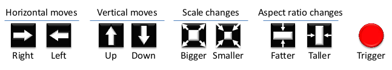

#### Paper A1
## Paper Title: Active object localization with deep reinforcement learning.
### Authors: Caicedo, Juan C., and Svetlana Lazebnik
### Conference: ICCV 2015

#### Problem Statement
The aim is to localize objects in scenes, a.k.a Object Detection. To do so, an active detection model is presented which is class-specific. A RL agent is trained such to deform a bounding box using simple transformation actions, with the goal of determining the most specific location of target objects following top-down reasoning. The agent's performance is evaluated on the Pascal VOC 2007 dataset. 

#### Proposed Model Outcome

#### RL Components
The problem has been modeled as a Markov Decision Process. Formally, the MDP has a set of actions A, a set of states S, and a reward function R. The set of actions A is composed of eight transformations that can be applied to the box and one action to terminate the search process.

#### Why use Reinforcement Learing here?
It is shown that agents guided by the proposed model are able to localize a single instance of an object after analyzing only between 11 and 25 regions in an image, and obtain the best detection results among systems that do not use object proposals for object localization.

